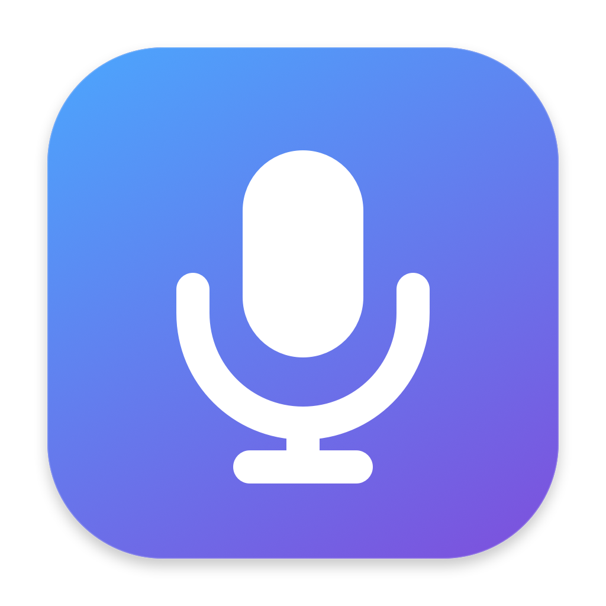
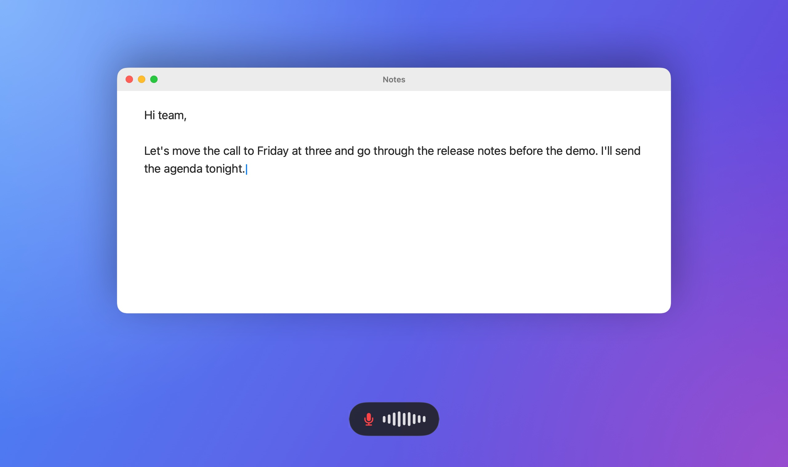
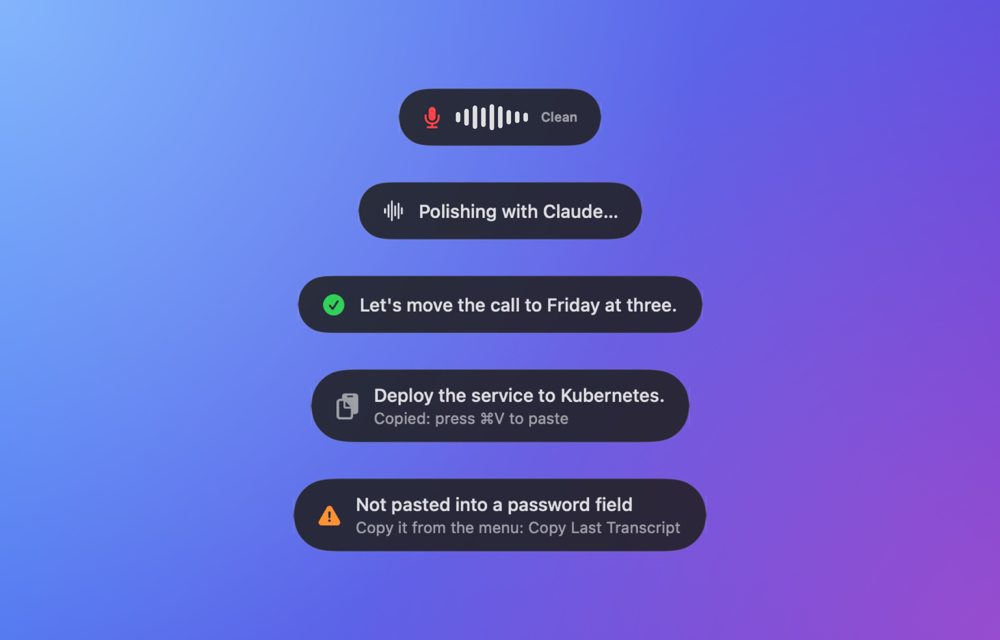
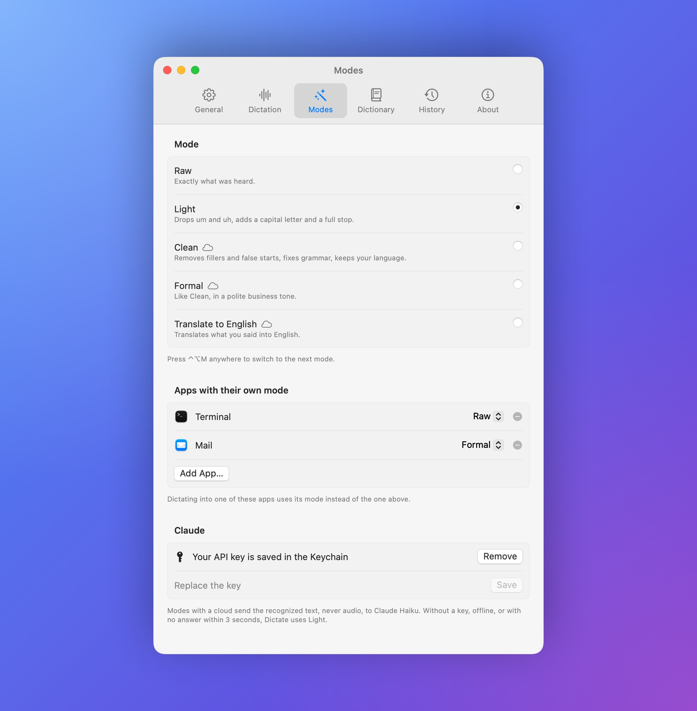

<p align="center">
  
</p>

<h1 align="center">Dictate</h1>

<p align="center">Push-to-talk dictation for macOS with on-device Whisper.</p>

<p align="center">
  <a href="https://github.com/okoflow/dictate/actions/workflows/ci.yml"></a>
  <a href="LICENSE"></a>
  
</p>

Hold the right Option key, speak, and let go: the text appears wherever you
are typing, in any app. Whisper turns your voice into text on your Mac, so the
audio never leaves it. When you want polished prose rather than a transcript,
a cloud mode rewrites the text with Claude.



## What it does

- **Types into any app.** The text is pasted into the focused field, and your
  clipboard is put back afterward. Password fields are left alone.
- **Recognizes speech on your Mac.** Whisper large-v3 turbo runs on Core ML
  through WhisperKit. Audio stays in memory and is never saved.
- **Understands thirteen languages.** Chinese, Dutch, English, French, German,
  Italian, Japanese, Korean, Polish, Portuguese, Russian, Spanish, and
  Ukrainian. Dictate detects which one you speak among those you choose.
- **Cleans up as much as you like.** Light removes hesitations such as "um",
  capitalizes the first letter, and adds a full stop, offline. Clean, Formal,
  and Translate to English rewrite the text with Claude Haiku. Any app can
  have a mode of its own.
- **Learns your words.** The dictionary fixes names and terms that come out
  wrong, and snippets turn a spoken phrase into text such as your email
  address.
- **Remembers when you want it to.** The last 50 dictations stay on your Mac,
  searchable and one click away from the clipboard.



## Install

Dictate is built from source. You need a Mac with Apple silicon, macOS 14 or
later, and the Command Line Tools for Xcode 26 or later; a full Xcode works
too.

```sh
git clone https://github.com/okoflow/dictate.git
cd dictate
make signing
make run
```

`make signing` runs once: it creates a local code-signing identity, so macOS
keeps the permissions you grant across rebuilds, and asks for your password
to trust it. `make run` builds `build/Dictate.app`, signs it, and opens it.
Copy the app to `/Applications` to keep it.

On first launch, a short guide asks for the microphone and Accessibility
permissions while Dictate downloads the speech model, about 630 MB. Loading
the model for the first time compiles it for your chip and takes about a
minute; after that it takes a second.

## Use it

1. Click into a text field in any app.
2. Hold **right Option** and speak.
3. Let go. The text appears a moment later.

| Keys | What they do |
| --- | --- |
| Hold right ⌥ | Dictate into the focused field while held |
| ⌃⌥M | Switch to the next mode |

Dictate lives in the menu bar. Its menu switches the mode and the language,
copies the last transcript, and opens Settings, where you can choose right
Command or right Shift as the dictation key, pick a microphone, and choose
the languages Dictate listens for.

## Modes

| Mode | What happens to the text | Leaves your Mac |
| --- | --- | --- |
| Raw | Nothing: exactly what Whisper heard | No |
| Light | Hesitations go, the first letter is capitalized, a full stop is added | No |
| Clean | Fillers and false starts go, grammar is fixed, the language stays | Text only |
| Formal | Like Clean, in a polite business tone | Text only |
| Translate to English | Translated into English | Text only |

Light is the default. Clean, Formal, and Translate to English need an
[Anthropic API key](https://console.anthropic.com/settings/keys), which you
add in Settings › Modes and which stays in your Keychain. Without a key,
offline, or when Claude does not answer within 3 seconds, Dictate uses Light
and says why, so you always get your text.



## Privacy

Speech recognition, Raw, and Light run entirely on your Mac. Dictate uses the
network for two things only: downloading the speech model once, and the cloud
modes, which send the recognized text, never audio, to the Anthropic API.
Dictated text never reaches the logs. [Privacy](docs/privacy.md) lists every
file Dictate keeps and how to remove it.

## Documentation

- [Usage](docs/usage.md): modes, languages, the dictionary, snippets, history,
  and settings.
- [How it works](docs/how-it-works.md): what happens between the key press and
  the pasted text.
- [Privacy](docs/privacy.md): what stays on your Mac and what leaves it.
- [Troubleshooting](docs/troubleshooting.md): permissions, the dictation key,
  the speech model, and logs.
- [Architecture](docs/architecture.md): the modules, their interfaces, and how
  they fit together.

## Contributing

[CONTRIBUTING.md](CONTRIBUTING.md) covers the development setup, the checks
that run in CI, and the commit and pull request conventions.

## Security

Report vulnerabilities privately through
[GitHub security advisories](https://github.com/okoflow/dictate/security/advisories/new).
[SECURITY.md](SECURITY.md) describes the process and the scope.

## License

Copyright The Dictate Authors, listed in [AUTHORS](AUTHORS).

MIT. See [LICENSE](LICENSE).
