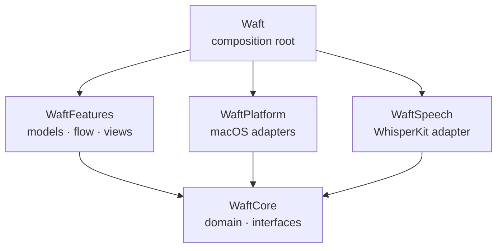
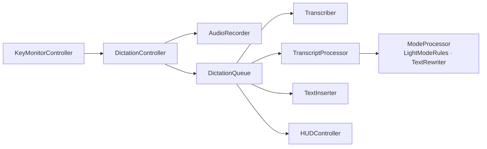

# Architecture

Waft is a Swift package of four libraries and an executable. The domain
and every interface live in one module that depends on nothing but
Foundation; the system frameworks and WhisperKit stay behind those interfaces,
and a single composition root wires the real implementations together.

## Modules

| Module | Isolation | What lives there |
| --- | --- | --- |
| `WaftCore` | Nonisolated | Domain types, text and recognition rules, state machines, and every interface |
| `WaftSpeech` | Nonisolated | `WhisperTranscriber`, the model files, and the language-restricted tokenizer |
| `WaftPlatform` | Nonisolated | Adapters for audio, the keyboard, Accessibility, the pasteboard, storage, the network, and the system |
| `WaftFeatures` | Main actor | Observable models, the dictation flow, the HUD, the menu, Settings, and the first-run guide |
| `Waft` | Main actor | The app, its delegate, and `AppDependencies.live()` |

Dependencies point toward `WaftCore`:

- `WaftCore` imports Foundation only.
- `WaftFeatures` depends on `WaftCore` alone. It never sees the AppKit
  adapters or WhisperKit, only their interfaces, so any implementation can
  stand in for them.
- `WaftPlatform` and `WaftSpeech` implement interfaces from
  `WaftCore` and know nothing about the features.
- Only the `Waft` executable names concrete adapters, in
  `AppDependencies.live()`.

Declarations shared between modules use `package` access; nothing is
`public`.

## Interfaces

| Interface | Abstracts | Live implementation |
| --- | --- | --- |
| `AudioRecorder` | Recording from a microphone | `AudioEngineRecorder`, on AVAudioEngine |
| `AudioInputProvider` | The list of input devices | `CoreAudioInputs` |
| `Transcriber` | The speech model's lifecycle and recognition | `WhisperTranscriber` |
| `TextRewriter` | Rewriting text in a cloud mode | `AnthropicRewriter`, `OpenAIRewriter` |
| `KeyEventMonitor` | Modifier key events | `ModifierKeyTap`, a listen-only event tap |
| `KeyboardState` | Whether a key is held right now | `SystemKeyboardState` |
| `GlobalShortcut` | The next-mode shortcut | `CarbonHotKey` |
| `FocusTracker` | The focused app and text field | `AccessibilityFocusTracker` |
| `TextInserter` | Pasting into the focused field | `PasteboardInserter` |
| `Clipboard` | Copying text | `SystemClipboard` |
| `PermissionProvider` | Microphone and Accessibility access | `SystemPermissions` |
| `LoginItem` | Opening at login | `MainAppLoginItem`, on SMAppService |
| `FeedbackSoundPlayer` | Start and stop sounds | `SystemSoundPlayer` |
| `ValueStore<Value>` | Loading and saving one value | `UserDefaultsStore`, `JSONFileStore`, `KeychainStore` |

`AppDependencies` collects one implementation of each, and a `TextRewriter`
and an API key store for each cloud provider, plus the stores for the
settings, the dictionary, and the history. `AppModel` takes it in its
initializer; there are no singletons.

## The dictation flow

1. `KeyMonitorController` keeps the `KeyEventMonitor` running, restarting it
   when a permission arrives or macOS switches it off.
2. `DictationController` feeds key events to `PushToTalk`, a state machine
   that decides when a recording starts, finishes, or is discarded, and polls
   `ReleaseWatchdog` in case a key-up is lost. It starts and stops the
   `AudioRecorder` and captures the focus target.
3. `DictationQueue` runs finished recordings one at a time: the `Transcriber`
   recognizes them, `TranscriptProcessor` applies the dictionary, snippets,
   and the mode, and the `TextInserter` pastes the result.
4. `ModeProcessor` runs `LightModeRules` or the `TextRewriter` under the
   3-second deadline, checks the answer with `RewriteValidator`, and falls
   back to Light with a `RewriteFallback` that says why.
5. The outcome becomes a `HUDMessage`, a history entry, and the latest
   transcript.

## State

Feature state lives in `@Observable` models owned by `AppModel`:
`SettingsModel`, `PermissionMonitor`, `SpeechModelController`,
`VocabularyModel`, `HistoryModel`, `APIKeyModel`, `FrontmostAppTracker`,
`OnboardingModel`, and `HUDController`. Views read them directly; changes
that affect other models, such as new languages reloading the speech model,
are wired once in `AppModel`.

Rules that need no system access are value types in `WaftCore`, so they
can be reasoned about on their own: `PushToTalk`, `ReleaseWatchdog`,
`SpeechModelState`, whose transitions return effects for the controller to
run, `InsertionDecision`, `PasteboardRestorePolicy`, `HallucinationFilter`,
and `LightModeRules`.

## Concurrency

The package builds in the Swift 6 language mode with complete concurrency
checking, and treats every warning as an error.

- `WaftFeatures` and the executables isolate their declarations to the
  main actor by default.
- `WaftCore`, `WaftSpeech`, and `WaftPlatform` are nonisolated.
  Values that cross into them are `Sendable`.
- `WhisperTranscriber` and `AudioEngineRecorder` are actors, so recognition
  and audio work stay off the main actor.
- Nonisolated async functions run on the caller's actor
  (`NonisolatedNonsendingByDefault`).

## Extending

- **A language.** Add a case to `Language` with its Whisper code, its names
  in `Language+Names`, and its writing systems in `Language+Typography`.
  Letter case and word spacing follow from the `WritingScript`; a full stop
  or question mark of its own goes next to them, and marks that comparisons
  ignore go in `Language+Folding`. Then add its rows: the shortest spellings
  of hesitation sounds in `HesitationPattern`, stock phrases in
  `StockPhrase`, and the example sentence in `WhisperPrompt`. A language
  without a row has none.
- **A mode.** Add a case to `Mode` with its title and summary. A cloud mode
  needs its instruction in `RewritePrompt`.
- **An adapter.** Implement the interface in `WaftPlatform` and pass it in
  `AppDependencies.live()`.

[CONTRIBUTING.md](../CONTRIBUTING.md) describes the code style and the checks.
