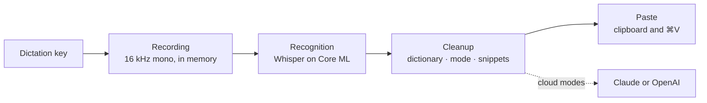

# How it works

What happens between pressing the dictation key and the text appearing in
your app. Every dictation passes through the same stages: the key, the
recording, recognition, cleanup, and the paste.

## The key

A listen-only event tap watches the modifier keys. It never swallows a key
press, so the dictation key keeps working everywhere else. Holding the key
starts a recording; releasing it after at least 0.3 seconds finishes it.
Shorter presses, another key pressed while holding, and recordings longer
than 5 minutes are discarded.

macOS can switch an event tap off when an app is busy, and a key-up can get
lost. Dictate checks the tap every 5 seconds and turns it back on, and while
you record it polls the key four times a second, so a lost key-up still ends
the recording.

## Recording

The microphone starts when the key goes down, from the device chosen in
Settings or the system default. Audio is converted to 16 kHz mono and kept
in memory; it is never written to disk. Recording continues for 0.15 seconds
after you let go, to catch the end of the last word.

The HUD appears after 0.3 seconds of holding, so a quick tap does not flash
it. It never takes focus: the app you are typing in stays active.

Dictate remembers the focused app and text field when you press the key. The
text goes there later, and the app decides which mode applies.

## Recognition

Recordings without speech never reach the model: silence, key clicks, and
steady noise are recognized by how long the audio stays above its own noise
floor. Everything else goes to Whisper large-v3 turbo, run on Core ML by
[WhisperKit](https://github.com/argmaxinc/argmax-oss-swift).

- **Language.** With one language pinned, Whisper decodes in that language.
  Otherwise it detects the language first, choosing only among the languages
  you enabled.
- **Prompt.** For most languages, Whisper first reads a short example
  sentence that nudges it toward punctuation and capitalization, followed by
  up to 200 characters of dictionary terms.
- **Long recordings.** Audio over 30 seconds is split at pauses.
- **Made-up text.** Whisper sometimes invents text in silence. Dictate drops
  results with low confidence or heavy repetition, results made only of tags
  such as `[music]`, an echo of the prompt, and stock phrases such as "Thanks
  for watching" when they are the whole result. The HUD then says "Didn't
  catch that".

## Cleanup

The recognized text goes through four steps:

1. Dictionary terms replace their misheard spellings.
2. If the whole text is a snippet phrase, the snippet text is used as it is,
   and the steps below are skipped.
3. The mode runs: Raw keeps the text, Light applies its rules, and the cloud
   modes ask the provider you chose.
4. Dictionary terms are applied again, because a rewrite can undo them, and
   snippet phrases inside the text are expanded.

### Light

Light works word by word. It removes hesitation sounds, such as "um", "uh",
"ээ", "мм", "äh", "euh", "음", or "えーと", in their stretched and hyphenated
forms, together with the commas around them, but keeps one that follows a
number, as in "5 мм". It tidies the spaces around punctuation, following
French spacing before `!`, `?`, `;`, and `:`, capitalizes the first letter in
languages with letter case, and ends text that ends in a letter or digit with
a full stop, "。" in Chinese and Japanese. Filler words with meaning, such as
"like", "ну", or "그러니까", stay: telling them apart needs Clean.

### Cloud modes

Clean, Formal, and Translate to English send the text, with a short
instruction for the mode, to the provider you chose: the Anthropic Messages
API with `claude-haiku-5-5` and thinking turned off, or the OpenAI Responses
API with `gpt-6-luna`, reasoning turned off, and `store: false`, so OpenAI
keeps no copy of the response. The transcript is marked as text to edit, never
instructions to follow, so dictating a question gives you the question rather
than an answer, and the model is told to reply with the text only. You can
rewrite a mode's instruction with **Instructions…** in Settings › Writing;
Dictate adds these rules after it either way.

The answer is checked before it is used. An empty answer, one more than three
times longer than what you said, one cut off or refused, and one in another
writing system than the language you spoke, or than Latin for Translate to
English, are rejected.

Dictate waits up to 3 seconds. Without a key, offline, on an error, a rate
limit, a timeout, or a rejected answer, it uses Light instead, and the HUD
adds a line that says why. The text is never lost.

## Pasting

Dictate pastes through the clipboard rather than typing key by key:

1. It waits for you to release the dictation key, for up to 10 seconds, since
   ⌘V with Option held would be a different shortcut.
2. It checks the focused field. A password field gets nothing, not even the
   clipboard; Copy Last Transcript in the menu gets the text back. If focus
   moved to another app or field, or Accessibility is not allowed, the text
   goes to the clipboard instead, and the HUD says "press ⌘V to paste".
3. It saves the clipboard contents, puts the text on the clipboard, and
   presses ⌘V on the key that types "v" in your keyboard layout, so Dvorak and
   Colemak work too.
4. Once the app has read the text, it puts your previous clipboard back. An
   app that does not read it within 1.5 seconds leaves the text on the
   clipboard.

A space goes before the text when the character before the cursor is not a
space, an opening bracket, or a quote, except in Chinese and Japanese text.

The clipboard is restored only when nothing else was copied in the meantime,
when it held no more than 5 MB, and when it did not hold a password manager's
concealed item; the managers clear those on a timer. Text, rich text, HTML,
images, PDFs, files, and URLs survive the paste; other private formats do not.

The pasted text is marked transient and concealed, so clipboard managers that
follow the [nspasteboard.org](http://nspasteboard.org) conventions do not
store it, and it stays off Universal Clipboard.

Texts are pasted one at a time, in the order you spoke them.

## The speech model

The model, `openai_whisper-large-v3-v20240930_626MB` from
[argmaxinc/whisperkit-coreml](https://huggingface.co/argmaxinc/whisperkit-coreml),
downloads once to `~/Library/Application Support/Dictate/Models`, about
630 MB. Core ML compiles it for your chip the first time it loads, which takes
about a minute, and keeps the compiled copy in
`~/Library/Caches/dev.dictate.app`, about 135 MB. Later loads take about a
second.

Changing the enabled languages reloads the model, which takes a moment. A
press while the model is not ready records nothing; the HUD says what the
model is doing instead.

On an Apple M5 Pro, a sentence of about six seconds takes 1.3 to 2 seconds
from release to text, language detection included.

## Limits

- The first syllable can be lost if you speak the instant you press the key.
- Apps that expose little to Accessibility, such as some Electron apps, games,
  and remote desktops, still get the paste, but Dictate cannot see the text
  before the cursor there, so it adds no leading space.
- When an app holds secure keyboard input and Dictate cannot see the focused
  field, it treats the field as a password field and pastes nothing.
- ⌃⌥M belongs to Dictate while it runs. If another app holds it already,
  switch modes from the menu.
