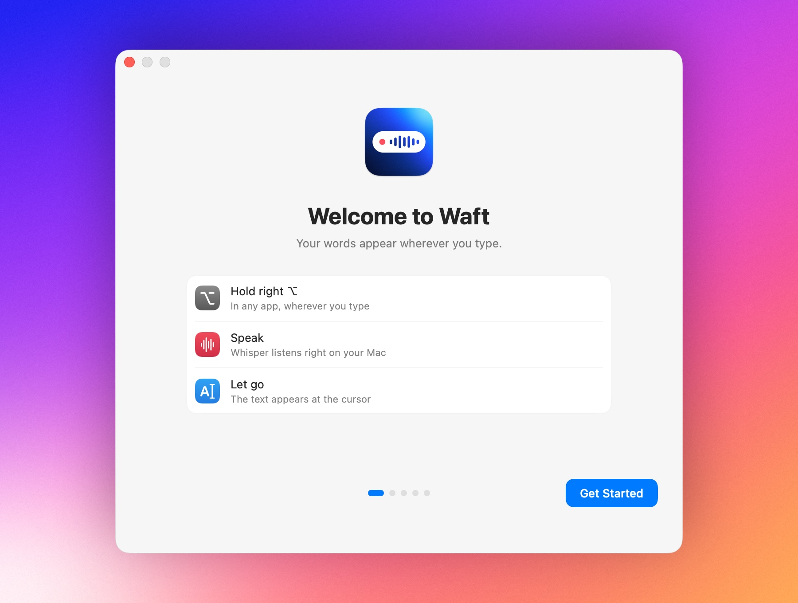
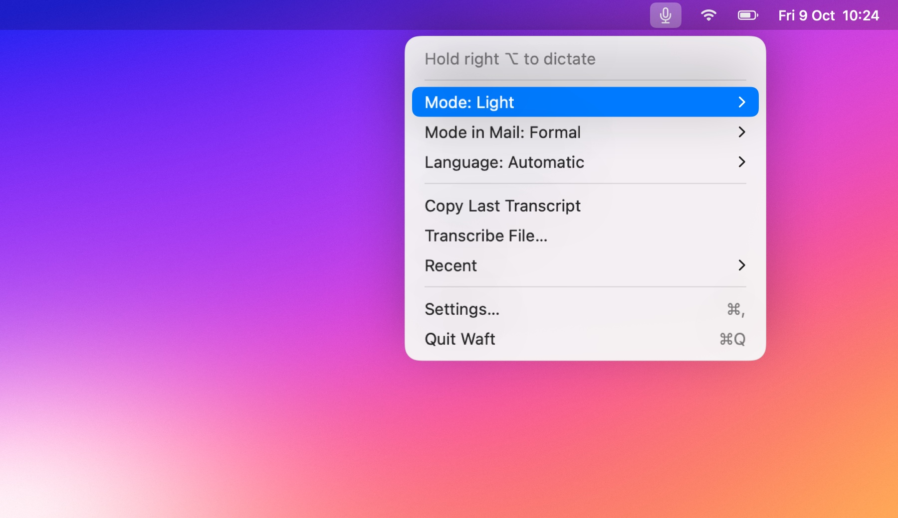
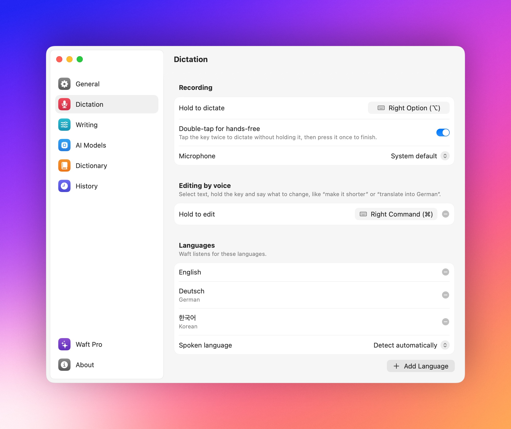

# Usage

How to dictate, and everything you can set up. What happens behind the scenes
is in [How it works](how-it-works.md).

## First launch

A short guide walks you through the setup: the gesture, the microphone and
Accessibility permissions, a field to try dictating into, and whether
Waft opens at login. The speech model downloads in the meantime, and the
guide's footer shows its progress.



Accessibility lets Waft notice the dictation key and paste the text. On
macOS 27, System Settings lists it under Privacy & Security › Device Control
and Data Access. If you close the guide early, **Finish Setup…** in the menu
brings it back.

## Dictating

Hold the dictation key, speak, and let go. While you speak, the HUD at the
bottom of the screen shows a level meter; once the text is pasted, it shows
the text.

- Start speaking a beat after you press the key: the microphone takes a
  moment to start.
- A press shorter than 0.3 seconds is ignored, so a tap does nothing.
- Pressing another key while you hold the dictation key cancels the
  recording, so Option shortcuts and special characters keep working.
- A recording stops on its own after 5 minutes.
- You can dictate again while the previous text is still being recognized.
  Texts arrive in the order you spoke them.

The dictation key is right Option by default. To change it, click the key in
Settings › Dictation and press another: Option, Command, Shift, or Control on
either side, fn (🌐), or an F-key. Keys that type text can't be used.

For longer dictation, tap the key twice quickly: Waft keeps listening
without the key held, shows **Hands-free** in the pill, and finishes when you
press the key once more. Turn off **Double-tap for hands-free** in
Settings › Dictation if you don't want it.

## The menu



| Item | What it does |
| --- | --- |
| Mode | Sets the mode for every app; ⌃⌥M switches to the next one |
| Mode in *app* | Gives the app in front a mode of its own |
| Language | Detects the language automatically, or pins one |
| Copy Last Transcript | Copies the latest text again for 10 minutes, even one that was not pasted |
| Transcribe File… | Turns a recording or a video into text or subtitles; see [Transcribing files](#transcribing-files) |
| Recent | Copies one of your last five dictations |
| Settings… | Opens Settings |

To hide the icon, turn off **Show in menu bar** in Settings › General.
Dictation keeps working, ⌃⌥M still switches the mode, and opening Waft
again brings up Settings.

## Modes

**Raw** pastes exactly what Whisper heard. **Light**, the default, removes
hesitation sounds such as "um", "uh", "ээ", or "음", tidies the spaces around
punctuation, capitalizes the first letter, and ends the text with a full
stop. Light works offline and leaves words with meaning alone: filler words
such as "like" and self-corrections need Clean.

Light also understands two voice commands. Say "new line" or "new paragraph"
as a phrase of its own, with a short pause before and after, and Waft
starts a new line or paragraph there. They work in 19 languages, for example
"новая строка", "neuer Absatz", or "à la ligne"; the pauses keep a sentence
such as "a new line of products" as it is.

The AI modes send the recognized text to the model you choose in
Settings › AI Models: Claude or OpenAI with your own key (marked with ☁︎), or
a model on a local server:

- **Clean** removes filler words and false starts, keeps only the final
  version when you correct yourself ("Thursday, no, Friday"), and fixes the
  grammar and punctuation, in the language you spoke. Spoken punctuation such
  as "comma" or "new paragraph" becomes the mark, dates, times, and amounts
  become digits, and items you enumerate ("first…, second…") go on numbered
  lines.
- **Formal** does the same in a polite business tone, keeping every point and
  the way you address the reader, such as du or Sie.
- **Translate** translates the text into the language you choose in
  Settings › Writing › Translation, English by default, in that language's
  spelling and formats. Set **Two-way with** to a second language to translate
  both ways: with English and Russian, what you say in English comes out in
  Russian and what you say in Russian comes out in English.

Without an API key, without a network connection, when the provider does
not answer within 3 seconds, or when its answer cannot be used, Waft
pastes the Light text instead, and the HUD says why.

### Editing selected text by voice

Choose a key under **Editing by voice** in Settings › Dictation. Then select
text in any app, hold that key, say what to change, such as "make it shorter",
"turn this into a list", or "translate into German", and let go. The model
from Settings › AI Models rewrites the selection and Waft pastes the result
over it. What you say is an instruction, not text to paste, so nothing is
added when the model can't be reached: the HUD says why and the selection
stays as it was.

Waft reads the selection through Accessibility. Apps that don't expose it,
such as some web views, show "Select the text to edit" instead.

### Transcribing files

**Transcribe File…** in the menu opens a window for recordings you already
have: interviews, voice memos, meetings, or videos. Drop an audio or video
file on it or choose one; Whisper transcribes it on the Mac, in the language
it detects or the one you pick from your dictation languages. Copy the text,
save it as a text file, or save subtitles as an SRT file with timestamps.
Long files are transcribed piece by piece, so dictation keeps working while a
file is in progress.

### Your own instructions

In Settings › Writing, **Instructions…** next to Clean, Formal, and Translate
shows what the mode asks the model to do, and lets you rewrite it, for example for a more
casual tone or your team's style. Waft still tells the model to treat
what you said as text and to reply with the text only. **Reset to Default**
brings back the original. Instructions you changed stay as you wrote them
when an update improves the defaults; Reset to Default switches to the new
ones.

### A mode for each app

An app can have a mode of its own, such as Formal in Mail and Raw in
Terminal. Choose **Mode in *app*** in the menu while the app is in front, or
add the app in Settings › Writing › Apps. Waft uses the mode of the app that
was in front when you pressed the key.

### The model for Clean, Formal, and Translate

Settings › AI Models lists every model these modes can use; click **Use** on
the one you want:

- **Local server** calls a model you run yourself with Ollama, LM Studio,
  llama.cpp, MLX, or Jan. **Detect** finds a running server, and **Model**
  lists the models it has loaded. Any server with an OpenAI-compatible
  `/v1/chat/completions` endpoint works.
- **Claude** and **OpenAI** need your own API key:

- Claude: create the key inside a workspace in the
  [Anthropic Console](https://console.anthropic.com/settings/keys).
- OpenAI: create the key in the
  [OpenAI dashboard](https://platform.openai.com/settings/organization/api-keys).

Each provider keeps its own key in your login Keychain, on this Mac only, and
Waft reads it for each cloud request. **Remove** deletes it.

## Languages



Add the languages you speak in Settings › Dictation with **Add Language**, and
Waft detects which of them you speak each time. Fewer languages make detection faster and
more accurate. To skip detection, pin one language with **Spoken language**
or the **Language** menu.

On first launch, Waft adds up to three of your macOS preferred languages
and English.

Waft understands 45 languages: Arabic, Azerbaijani, Bosnian, Bulgarian,
Catalan, Chinese, Croatian, Czech, Danish, Dutch, English, Estonian, Filipino,
Finnish, French, Galician, German, Greek, Hebrew, Hindi, Hungarian, Indonesian,
Italian, Japanese, Korean, Latvian, Lithuanian, Macedonian, Malay, Norwegian,
Polish, Portuguese, Romanian, Russian, Serbian, Slovak, Slovenian, Spanish,
Swedish, Tamil, Thai, Turkish, Ukrainian, Urdu, and Vietnamese. They are the
languages in which Whisper gets no more than 30% of the words wrong in OpenAI's
published tests and that the model Waft ships also handles well. Spanish,
Italian, Korean, Portuguese, and English come out best; Tamil and Hebrew come
out worst.

## Dictionary and snippets

Settings › Dictionary holds two lists.

**Terms** are names and words that come out wrong. Waft gives them to
Whisper as a hint, then replaces the spellings Whisper still writes instead:
list them under **Heard as**, separated by commas. Replacements match whole
words in any letter case and work in every mode, Raw included.

**Snippets** turn a phrase into text. Say the phrase on its own, and Waft
pastes the text exactly as written without sending anything to the cloud. The
phrase inside a longer dictation is replaced too.

Both lists live in `dictionary.json`, which **Open in Editor** opens:

```json
{
  "terms": [
    { "term": "Kubernetes", "spoken": ["kubernetis", "kuber"] },
    { "term": "WhisperKit" }
  ],
  "snippets": [
    { "trigger": "my email", "text": "name@example.com" }
  ]
}
```

Edits to the file apply from the next dictation.

## History

Settings › History starts with this week: how many words you dictated, the
time that saved over typing at 40 words a minute, and your speaking speed,
with a chart of the last two weeks. Only these counts are kept, never the
text, and **Reset Stats…** sets them back to zero.

Below that, Settings › History lists your dictations with the time, the mode, and the app,
and copies any of them with one click. They stay for a month and up to 1,000
dictations unless you change **Keep dictations for** (a day to forever) or
**Keep at most** (100 to 10,000). Turn off
**Keep history** to stop saving new ones; **Clear History…** deletes them all. A text kept out of
a password field is never saved.

## Settings

| Pane | What you set there |
| --- | --- |
| General | Opening at login, the menu bar icon, sounds, permissions |
| Dictation | The dictation key, hands-free, the microphone, the editing key, languages |
| Writing | The mode and its instructions, translation, per-app modes, pasting |
| AI Models | The speech model, a local server, and Claude or OpenAI with your API keys |
| Dictionary | Terms and snippets |
| History | This week's stats, how long and how much to keep, searching, copying, and clearing |
| Waft Pro | The free trial, what Pro adds, and your license |
| About | The version, the source code, and the license |

With **Paste into the focused field** off, Waft only puts the text on the
clipboard for you to paste with ⌘V.

## Waft Pro

Dictation with Whisper, the Raw and Light modes, voice commands, the
dictionary, and history are free. Waft Pro adds Clean, Formal and
Translate with any AI model, translation both ways, your own instructions,
editing by voice, and file transcription, for a single payment of $13.99.

Every Pro feature works for 3 days after the first launch. After that,
Pro modes fall back to Light and the HUD says so, until you buy a license
from Settings › Waft Pro. The license key arrives with your receipt: paste
it under **License**, or open the activation link from the email. Waft
checks the key on the Mac, without contacting a server.
